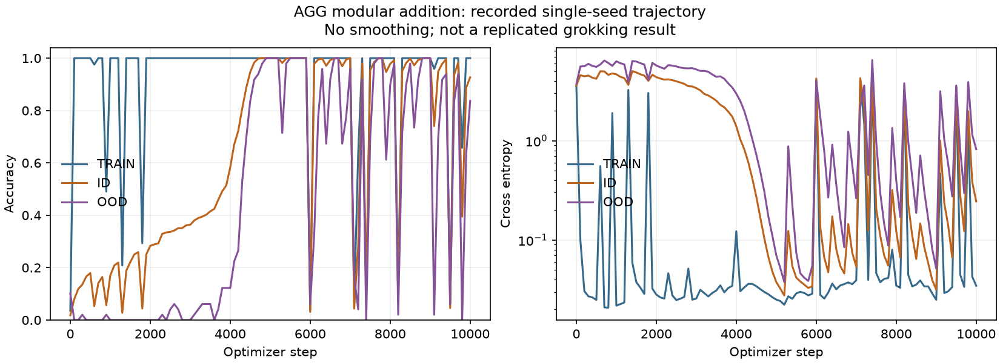

# Executed verification

Verified locally on 2026-09-16 with Python 3.12.13, PyTorch 2.14.0+cpu,
Geoopt 0.5.1 and NumPy 2.5.3. Exact installed versions and CPU details are in
[environment.json](../examples/results/environment.json). This report separates
software verification from scientific validation.

## Checks actually run

- `python -m pytest -q`: **143 passed**. One upstream Geoopt-triggered TorchScript
  deprecation warning; no failed or skipped tests.
- `python -m ruff check agg tests examples`: passed.
- `python -m mypy agg`: passed across 35 source files.
- Editable package installation, source distribution and wheel build: passed.
- Modular, hierarchy and retrieval end-to-end smoke configurations: executed.
- 32 retrieval factorial runs across 16 four-factor cells and two seeds: executed.
- A 10,000-step modular addition baseline with seed 0: executed.
- Serialized selected models: weights-only reload tested; stored ternary tensors
  decoded and compared exactly against selected model parameters.

CI is configured in `.github/workflows/ci.yml`; local results do not imply hosted
CI passed. Publication status and hosted check results are reported separately.

## Research results and limits

The short smoke models are deliberately undertrained. Arithmetic ID accuracy was
5.97% and hierarchy balanced accuracy was 50% before interventions. Accepting a
smaller candidate at these capability levels is software evidence, not evidence
of useful learned-model compression. Full before/after records, including rejected
precision choices, are retained in [examples/results](../examples/results/).

The longer arithmetic baseline reached **92.69% ID and 83.67% OOD accuracy at step
10,000**. The trajectory includes delayed high accuracy and repeated collapses.
One seed with unstable performance does not establish a replicated grokking result
or a consolidation advantage. No hyperparameters were retuned to hide this outcome.

All 32 short factorial runs are right-censored at step 12: no sustained retrieval
crossing was observed. `phase-surface.json` retains those missing onsets explicitly.
Synthetic fixtures verify that the crossing algorithm detects known stable
crossings and rejects isolated noisy crossings; that is distinct from an observed
model phase transition.

## Mapping to the brief's 22 checks

| # | Requirement | Executed evidence |
|---|---|---|
| 1–2 | Tests, lint, types | Commands above; 143 tests |
| 3–4 | Modular and hierarchy smoke | Full run artifacts in results folders |
| 5 | Complete telemetry snapshots | Versioned category-complete raw/derived/availability/proxy records; unavailable measurements remain null |
| 6 | Known first/second derivatives | Nonuniform quadratic curve tests |
| 7 | Distinct M/R probes | Controlled prediction fixture and executed retrieval ablation/neighbor probes |
| 8 | Crossover detection | Stable/noisy/censored fixtures; observed factorial censoring retained |
| 9 | Gate intervention | Five forced values; learned-gate and exact bypass tests |
| 10 | Rejected consolidation rollback | Identity, weights, buffers and RNG tests; hashes in rejected ledger rows |
| 11 | Precision rejection | Negative tests and real rejected precision candidates in all three smoke ledgers |
| 12 | Precision/storage separation | Dense fake rounding versus exact symbol codec APIs |
| 13–15 | Dense and sparse wins, zero density | Tiny and sparse fixtures; metadata-inclusive measured storage.json |
| 16 | Actual fixed/BITCOS-like benchmark | CPU decode and decode-plus-dense-matmul timings; no optimized kernel claim |
| 17 | Intent versus actual transition | Failed divide-by-zero trace with unchanged state despite success intent |
| 18 | Verifier over conflicting teacher | Confidence/provenance and bounded-mixture tests plus execution artifact |
| 19 | Multiple credit settings | Gamma 0, .5, .9, 1 fixtures and named immediate/discounted controls |
| 20 | Ablation removes work | Every named family exercised; derivative/attribution bypass tests; baseline CLI override |
| 21 | Complete intervention ledger | All candidate decisions plus physical-storage decisions and exact round-trip evidence |
| 22 | Proxies identified | Schema flags, metric glossary, coding-proxy labels and method names |

## Remaining research scope

The execution subsystem is an actual deterministic environment and credit
demonstration; trained-agent supervision comparisons are not implemented. Compute
and accumulator precision are recorded targets; full arithmetic simulation is not
implemented. Low-rank proposals exist as tensor functions, not a checkpoint-class
sweep command. Per-layer adapter APIs exist, while the runner adapts final hidden
states. Optional persistent-homology execution was not run in this environment.
The current mechanism gate uses CKA, a representation proxy; proving preservation
of a configured causal circuit requires further interventions. ID/OOD partitions
are development validation sets, so confirmatory untouched tests remain necessary.

The full scientific program and its milestones are **not complete**. These results
verify the implemented research harness and expose negative/inconclusive outcomes.
